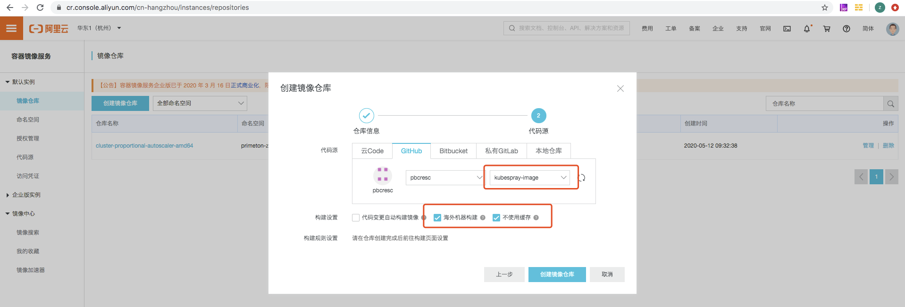

<div style="padding-top: 40px"></div>

******
  
# 在线安装
  
******

   
<div style="page-break-after: always;"></div>


## 初始化配置（所有机器执行）

### 关闭防火墙

```bash  
systemctl disable firewalld && systemctl stop firewalld
```  

### 关闭selinux

```bash  
sed -i 's/SELINUX=enforcing/SELINUX=disabled/g' /etc/selinux/config
setenforce 0
```  

### 优化内核参数

```bash  
vi /etc/security/limits.conf
``` 

```bash
* soft nofile 32768
* hard nofile 65535
* soft nproc 32768
* hadr nproc 65535
``` 

```bash  
sysctl --system && sysctl -p
``` 

### 关闭系统交换分区

```bash  
swapoff -a && echo "vm.swappiness=0" >> /etc/sysctl.conf && sysctl -p && free –h
``` 

### 重启机器

```bash  
reboot
``` 

<div style="page-break-after: always;"></div>

## 安装执行（仅安装节点执行）

### 下载kubespray并解压

```bash
git clone https://github.com/kubernetes-sigs/kubespray.git
```

### 安装python3依赖环境

```bash  
yum install python3 -y
``` 

### 安装kubespray依赖环境

```bash  
pip3 install -r requirements.txt
``` 

### 拷贝安装目录

```bash  
cp -rfp inventory/sample inventory/mycluster
``` 

### 配置安装机器信息

```bash  
declare -a IPS=(10.10.1.3 10.10.1.4 10.10.1.5)
CONFIG_FILE=inventory/mycluster/hosts.yaml python3 contrib/inventory_builder/inventory.py ${IPS[@]}
``` 

### 配置免密登录

```bash  
ssh-keygen
ssh-copy-id -i root@10.10.1.3
ssh-copy-id -i root@10.10.1.4
ssh-copy-id -i root@10.10.1.5
``` 

### 测试连接

```bash  
ansible -i inventory/mycluster/hosts.yaml all -m ping
``` 

### 安装执行

```bash  
ansible-playbook -i inventory/mycluster/hosts.yaml cluster.yml
``` 

## 报错处理

在国内的网络环境下，这样直接执行安装肯定会报错，主要问题为一些二进制文件及镜像无法下载，具体解决办法如下。

### 二进制文件下载

此处使用阿里云的下载地址，一般二进制文件的更新会比较及时，不会存在没有对应版本的问题。也可以根据配置文件的原地址科学上网下载。

```bash  
vi roles/download/defaults/main.yml
``` 

```bash
kubectl_download_url: "http://kubernetes.oss-cn-hangzhou.aliyuncs.com/kubernetes-release/release/{{ kube_version }}/bin/linux/{{ image_arch }}/kubectl"
kubelet_download_url: "http://kubernetes.oss-cn-hangzhou.aliyuncs.com/kubernetes-release/release/{{ kube_version }}/bin/linux/{{ image_arch }}/kubelet"
kubeadm_download_url: "http://kubernetes.oss-cn-hangzhou.aliyuncs.com/kubernetes-release/release/{{ kubeadm_version }}/bin/linux/{{ image_arch }}/kubeadm"
``` 

### 镜像下载

问题较多出在这一步，kubespray通常会更新最新的镜像版本支持，但国内的一些镜像源不会做实时的更新。所以想找一个可以直接替代使用的镜像源很难，这里我们自己处理部分k8s镜像同步。

```bash  
vi roles/download/defaults/main.yml
``` 

```bash
# gcr_image_repo: "gcr.io"
gcr_image_repo: "registry.aliyuncs.com"
# kube_image_repo: "k8s.gcr.io"
kube_image_repo: "registry.cn-hangzhou.aliyuncs.com/primeton-zzk"
``` 

```bash 
vi inventory/mycluster/group_vars/k8s-cluster/k8s-cluster.yml
```

```bash 
# kube_image_repo: "k8s.gcr.io"
kube_image_repo: "registry.cn-hangzhou.aliyuncs.com/primeton-zzk"
```

需要自行同步的具体镜像如下（版本参考roles/download/defaults/main.yml文件中的信息自行梳理）：

```bash  
cluster-proportional-autoscaler-amd64
kube-proxy
kube-apiserver
kube-controller-manager
kube-scheduler
k8s-dns-node-cache
pause
``` 

## 镜像同步

因为国内的网络环境问题，在使用一些国外的镜像源时经常会碰到一些问题，这里使用aliyun提供的镜像构建功能同步国外镜像（aliyun该功能目前免费）。

- 新建命名空间
 

- 创建镜像仓库（仓库名称即为镜像名）
 

- 关联github仓库 （选择海外机器构建）
 

- github库添加dockerfile （配置同步的镜像地址及版本）
 

- 添加构建规则
 

- 执行构建
 

- 复制镜像地址
 

